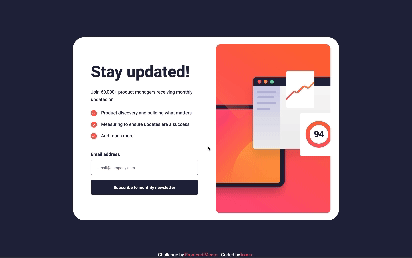
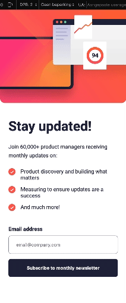

# Frontend Mentor - Newsletter sign-up form with success message solution

This is a solution to the [Newsletter sign-up form with success message challenge on Frontend Mentor](https://www.frontendmentor.io/challenges/newsletter-signup-form-with-success-message-3FC1AZbNrv). Frontend Mentor challenges help you improve your coding skills by building realistic projects.

## Table of contents

- [Overview](#overview)
  - [The challenge](#the-challenge)
  - [Screenshot](#screenshot)
  - [Links](#links)
- [My process](#my-process)
  - [Built with](#built-with)
  - [What I learned](#what-i-learned)
- [Author](#author)

## Overview

### The challenge

Users should be able to:

- Add their email and submit the form
- See a success message with their email after successfully submitting the form
- See form validation messages if:
  - The field is left empty
  - The email address is not formatted correctly
- View the optimal layout for the interface depending on their device's screen size
- See hover and focus states for all interactive elements on the page

### Screenshot

#### Screensize 1440px - Desktop



#### Screensize 375px - Mobile



### Links

- View my Solution on [Frontend Mentor]()
- View the [Live Site]()

## My process

- HTML semantics
- JavaScript
- Importing Google Fonts
- Set variables
- Reset default settings
- Styles (Mobile First)

### Built with

- Semantic HTML5 markup
- JavaScript
- SASS custom properties
- CSS Grid
- CSS Flexbox
- Mobile-first workflow
- [Google Fonts](https://fonts.google.com/) - For Fonts

### What I learned

```js
"use strict";

const form = document.getElementById("form");
const message = document.querySelector(".succes_message");
const dismiss = document.getElementById("dismiss_button");
const email = document.getElementById("email");
const mirror = document.getElementById("users_email");

// Mirror the input value into the succes message:
email.addEventListener("input", function (event) {
  mirror.innerText = event.target.value.split("").join("");
});

// Listen for events on form:
form.addEventListener("submit", (e) => {
  // This tells the browser to prevent the form from submitting by default:
  e.preventDefault();

  const emailInput = email.value;
  const small = form.querySelector("small");

  // When the input is empty or invalid, do this:
  if (!isValidEmail(emailInput)) {
    form.classList.add("error");
    small.innerText = "Valid email required";

    // When the input is valid, do this:
  } else {
    form.classList.remove("error");
    message.classList.add("display_message");
  }
});
// REGEX = Regular Expression
function isValidEmail(emailInput) {
  return /^[a-zA-Z0-9._%-]+@[a-zA-Z0-9.-]+.[a-zA-Z]{2,4}$/.test(emailInput);
}

// Function for Dismiss Button
function close() {
  message.classList.remove("display_message");
  document.getElementById("email").value = "";
  window.location.reload();
}
// Call the function close() when dismiss button is clicked
dismiss.onclick = close;
```

## Author

- Frontend Mentor - [@kxnzx](https://www.frontendmentor.io/profile/kxnzx)
